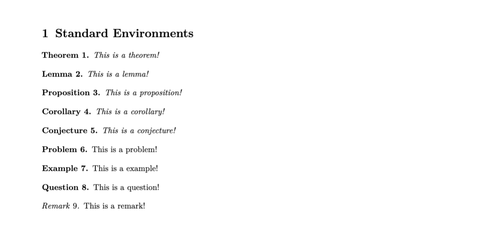
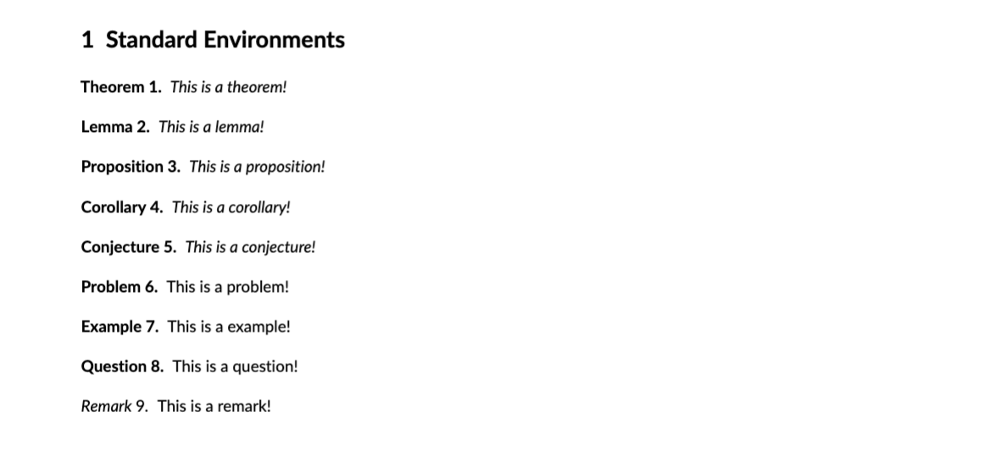
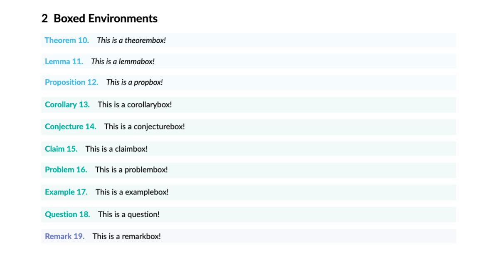
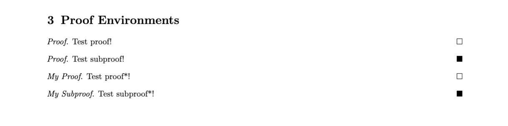
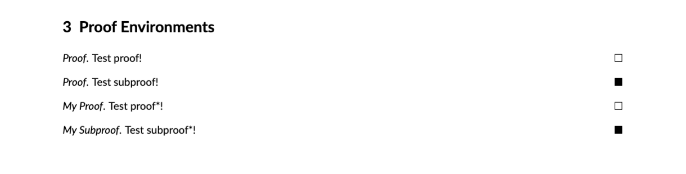

# style

 Container for eje.sty. Many thanks to Jason Chen, from whose style file this one drew significant inspiration (structurally and otherwise). 

## Table of Contents
1. [Package Options](#package_options)
2. [Environments](#environments)
3. [Additional Settings](#additional_settings)
4. [Examples](#examples)
5. [Packages](#packages)
6. [Known Bugs](#known_bugs)
7. [Future Features](#future_features)

##  Package Options

Below is a list of currently supported options. For additional and option-specific settings, see [additional settings](#additional_settings).

| Option | Default | Functionality |
| --- | --- | --- |
| pset | off | Include this option if you're writing a pset. Additional functionality is described below in [pset settings](#pset_settings).  |
| formal | off | TODO |
| nodate | off | TODO | 
| noheader | off | Include this option if you don't want a header. Additional header functionality is described below in [header settings](#header_settings). |
| marginnum | off | Include this option to put section numbers in the margin. |
| monochrome | Emerald | TODO - A string option. Include  <code> monochrome=COLOR_NAME </code> to switch all tcolorboxes to <code> COLOR_NAME </code>. For a list of color options, see [here](https://en.wikibooks.org/wiki/LaTeX/Colors). |

##  Environments

This package provides numerous environments out of the box. They are described below.

### Standard Environments
The standard environments include `theorem`, `lemma`, `proposition`, `corollary`, `conjecture`, `definition`, `problem`, `example`, `question`, and `remark`.

The following pictures illustrate what the environments look like in each of the two aesthetic modes.

In formal mode:

In casual (not-formal) mode:

### Boxed environments
The boxed environments include `theorembox`, `lemmabox`, `propbox`, `corollarybox`, `conjecturebox`, `claimbox`, `defbox`, `problembox`, `examplebox`, `questionbox`, and   `remarkbox`. For purely aesthetic purposes, they are **not** intended to be used in formal mode. The following picture illustrates the environments in causual mode.

Colors can be customized. For more details, see the [color settings](#color_settings) section.
### Proof environments
The proof environments include `proof`, `subproof`, `proof*`, and `subproof*`. Their features are described below.

| Environment | Description |
| --- | --- |
| `proof` | Standard proof environment. Optional parameter for theorem name (`\begin{proof}[Test Proof]` would yield "*Proof (Test Proof).*"). Ends with `$\square$`.|
| `subproof` | Same as `proof`, but ends with `$\blacksquare$`.|
|`proof*` | Same as `proof`, but has mandatory parameter for theorem name (`\begin{proof*}{Test Proof}` would yield "*Test Proof.*") |
| `subproof*` |Same as `proof*`, but ends with `$\blacksquare$`. |

The following pictures illustrate what the proof environments look like in each of the two aesthetic modes.

In formal mode:

In causual mode:

##  Additional Settings
Additional settings can be specified in the preamble of your document. Some general ones are listed below.

| Setting | Default | What|
| --- |---  |--- |
| Name | Ben Bitdiddle | Your name. To set the name to <code>NAME</code>, add <code>\setname{NAME}</code> to the preamble of your document. |
| | | |

###  Header Settings 
| Setting | Default | What  |
| --- |---  |--- |
| | | |

###   Color Settings
For coloring purposes, boxed theorem environments are partitioned into three groups: **plain**, **def**(inition), and **remark**. The groups are as follows.

* plain: <code>theorembox</code>, <code>lemmabox</code>, <code>propbox</code> (proposition)
* def: <code>corollarybox</code>, <code>conjecturebox</code>, <code>claimbox</code>, <code>defbox</code> (definition), <code>problembox</code>, <code>questionbox</code>, <code>examplebox</code>
* remark: <code>remarkbox</code>

These correspond to the three theoremstyles provided by the <code> amsthm </code> package. Colors can be set for each of these groups separately, as described below.
| Setting | Default | What |
| --- |---  |--- |
| plaincolor | CornflowerBlue | The color of the plain group. Can be set to <code> COLOR </code> by adding <code> \setplaincolor{COLOR}</code> to the preamble. |
| defcolor | Emerald | The color of the def group. Can be set to <code> COLOR </code> by adding <code> \setdefcolor{COLOR}</code> to the preamble.  |
| remarkcolor | Periwinkle | The color of the remark group. Can be set to <code> COLOR </code> by adding <code> \setremarkcolor{COLOR}</code> to the preamble.  |
| linkcolor | | TODO - hyperref stuff |

###   pset Settings
If you're typing up a single pset assignment... BLAH BLAH FILL THIS IN

| Setting | Default | What |
| --- |---  |--- |
| Class | 0.000 |  The class to which this homework/pset belongs. To set the name to <code>CLASS</code>, add <code>\setpsetclass{CLASS}</code> to the preamble of your document. |
| Style | standalone | To set the style to <code>STYLE</code>, add <code>\setpsetstyle{STYLE}</code> to the preamble of your document. |

##  Examples
This section contains several minimal examples. Pictures will be added eventually.

###  pset Example

###  formal example

###  Miscellaneous Example

##  Packages:
This style file uses the following packages.
| Package  | Use  |
|---|---|
| xparse  | For greater control over arguments.  |
| xstring |  For extended string functionality |
| etoolbox | For patching commands (such as <code> \patchcmd </code>), and extended boolean functionality.  |
| kvoptions  | For extended option functionality (e.g. passing in string options)  |
| thmtools  | better theorem declaration syntax |
| scrlayer-scrpage  | For KOMA-script header functionality. (KOMA doesn't like fancyhdr) |
|  subfiles |   |
| xcolor | For fancy colors. |
| graphicx  | For fancy graphics and image handling  |
| lmodern  |  Font stuff |
| cmbright  | Font stuff |
| lato  |  Font stuff |
|  microtype |  Font stuff |
|  setspace | Line spacing |
|  geometry |   |
| tikz | For TikZ diagrams.|
| enumitem | For lists|
| tcolorbox | For color box environments. |
| hyperref | For hyperlinks. |
| cleveref | Smarter theorem referencing (currently unused) |

## Known Bugs:
- Placing <code>\setdefcolor{Emerald}</code> (or any other color) immediately before <code>\begin{document}</code> results in an error. Placing it after <code>\begin{document}</code>, or placing another command, such as <code>\setpsetstyle{series}</code> between the two resolves this issue.

If you find another, please let me know!

##  Future features:
Below is a list of functionality that will eventually be implemented.
- error handling + checking that KOMA is properly loaded 
- fix margin number to support pset headers
- pset new page settings
- add in algorithm support
- add in minted support (for python and similar)
- newpsetproblem spacing issues (before and after)
- add arguments to boxes (<code>\begin{defbox}[myDefinition name]</code>)

